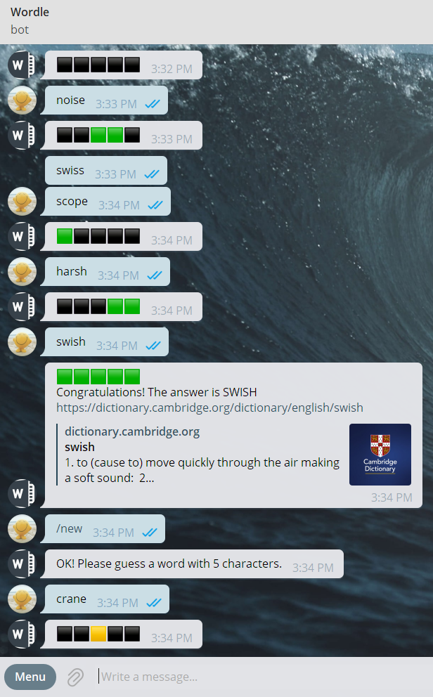
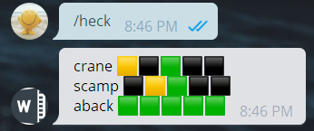

# Telegram Bot - Wordle Game and Auto Guess
## Features
* Start a new game in anytime
* You can play online with your friends or play it yourself
* No limits on the number of guesses
* When you hit the answer, it will automatically send you an online definition of Cambridge Dictionary
* The word library is similar to that in wordle
* Auto guess based on the algorithm 

## Screenshots of gameplay
### Commands
#### Start a new game

#### Heck - Auto guess


## Guessing Algorithm
Given a possible word list:

1. Remove words in the list that contains bad letters (black block).
2. Remove words that does not contain right-place letters (green block).
3. Remove words that contains wrong-place letters (yellow block).
4. When a good letter (green block and yellow block ) does not in the word, then remove it.
5. If the letter are both good and bad, then there are duplicate letters in the word. Remove words that doesn't match up the number of duplicate letters.
6. Choose the most possible word based on letter frequencies, and guess for the next round.

The above algorithm is executing in loop until it reaches the final answer.

## Future
The target word is stored in the google spreadsheet, which may cause problems when the game is conducted in two or more chat rooms. I need to find a better way to solve it.
